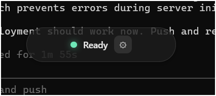
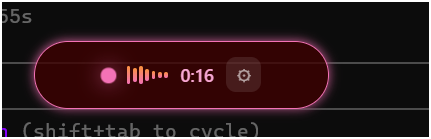
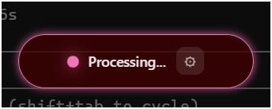
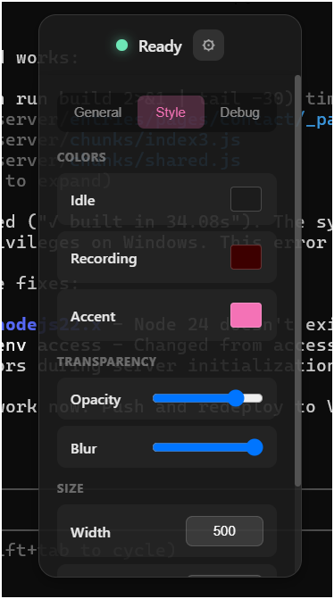
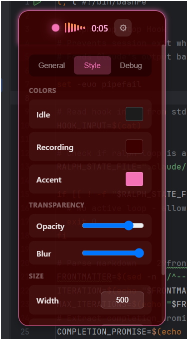

# WhisperVoice

> **Fast, local voice-to-text for Windows**

A minimal floating voice transcription tool. Press a hotkey or click the pill, speak, and your words are transcribed and pasted instantly.

**100% local and offline** - Uses [faster-whisper](https://github.com/guillaumekln/faster-whisper) for fast, private transcription.

## Screenshots

<p align="center">
  
  &nbsp;&nbsp;&nbsp;
  
</p>

<p align="center">
  <em>Ready to record</em>
  &nbsp;&nbsp;&nbsp;&nbsp;&nbsp;&nbsp;&nbsp;&nbsp;&nbsp;&nbsp;&nbsp;&nbsp;&nbsp;&nbsp;&nbsp;&nbsp;&nbsp;&nbsp;&nbsp;&nbsp;&nbsp;&nbsp;&nbsp;&nbsp;
  <em>Recording in progress</em>
</p>

<p align="center">
  
</p>

<p align="center">
  <em>Processing transcription</em>
</p>

### Settings Panel

<p align="center">
  
  &nbsp;&nbsp;&nbsp;
  
</p>

<p align="center">
  <em>Settings (idle)</em>
  &nbsp;&nbsp;&nbsp;&nbsp;&nbsp;&nbsp;&nbsp;&nbsp;&nbsp;&nbsp;&nbsp;&nbsp;&nbsp;&nbsp;&nbsp;&nbsp;&nbsp;&nbsp;&nbsp;&nbsp;&nbsp;&nbsp;&nbsp;&nbsp;&nbsp;&nbsp;&nbsp;&nbsp;
  <em>Settings (recording)</em>
</p>

## Features

- **Floating Pill UI** - Minimal, always-on-top indicator
- **Global Hotkey** - `Ctrl+Shift+Space` to toggle recording
- **Click to Record** - Or just click the pill
- **Auto-Paste** - Transcribed text is copied and pasted automatically
- **Multiple Models** - Choose from tiny to large-v3 for speed vs accuracy
- **Customizable** - Colors, opacity, blur effects
- **Draggable** - `Alt+Drag` to reposition

## Quick Start

### Prerequisites

- Windows 10/11
- Python 3.10+ with `faster-whisper` installed
- Node.js 18+

### Installation

```bash
# Clone the repository
git clone https://github.com/yourusername/WhisperVoice.git
cd WhisperVoice

# Install Python dependency
pip install faster-whisper

# Install and run the Electron app
cd whispervoice-electron
npm install
npm start
```

On first transcription, the selected Whisper model will be downloaded automatically.

## Usage

1. **Launch the app** - A floating pill appears in the top-left corner
2. **Press `Ctrl+Shift+Space`** or **click the pill** - Recording starts (pill turns pink)
3. **Speak** - Say what you want to transcribe
4. **Press hotkey again** or **click** - Recording stops, transcription begins
5. **Text is pasted** - Transcribed text is copied to clipboard and pasted

### Controls

| Action | How |
|--------|-----|
| Start/Stop Recording | `Ctrl+Shift+Space` or click pill |
| Move Window | `Alt+Drag` |
| Open Settings | Click gear icon or `F12` |

## Settings

- **Model** - Choose transcription model (tiny → large-v3)
- **Auto-paste** - Toggle automatic pasting after transcription
- **Always on top** - Keep pill above other windows
- **Colors** - Customize idle, recording, and accent colors
- **Opacity/Blur** - Adjust transparency effects

### Available Models

| Model | Speed | Accuracy | Notes |
|-------|-------|----------|-------|
| `tiny` | Fastest | Lower | Good for quick notes |
| `base` | Fast | Good | Balanced |
| `small` | Medium | Better | Default |
| `medium` | Slow | High | More accurate |
| `distil-large-v3` | Fast | High | Best speed/quality ratio |
| `large-v3` | Slowest | Highest | Maximum accuracy |

## Tech Stack

- **Electron** - Cross-platform desktop app
- **faster-whisper** - CTranslate2-based Whisper implementation
- **Python** - Transcription backend

## License

MIT License - See [LICENSE](LICENSE) for details.

## Roadmap

- [ ] GPU acceleration (CUDA support)
- [ ] System tray with menu
- [ ] Configurable hotkey
- [ ] Language selection
- [ ] Context capture (IDE, browser, terminal)
- [ ] Multi-selection monitoring

## Acknowledgments

- [OpenAI Whisper](https://github.com/openai/whisper) for the speech recognition model
- [faster-whisper](https://github.com/guillaumekln/faster-whisper) for the optimized implementation
- [Tight.sh](https://tight.sh/) for the inspiration
